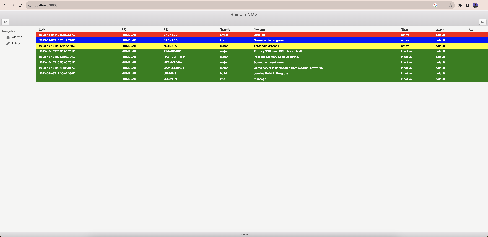
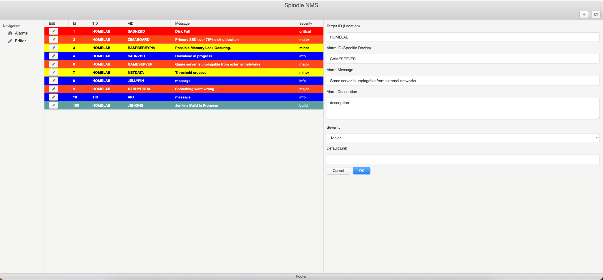

# Spindle Home Lab Monitoring System (HLMS)
Spindle HLMB is a super lightweight next based alarm point monitoring system for use in home labs. It is fully contained and uses a json file located in the project
root as it's primary db. It's not designed for corporate NMS usage though a db version does exist for those scenarios.



Spindle implements realtime monitoring by listening to websockets and refreshing the alarms when new ones hit the API.



Alarm creation and editing can be done using the build in editor.

## Development:
```
npm install -g next
npm install
npm run dev 
```

## Installing
```
docker run -d -p 3000:3000 --rm plasmatrout/spindle-nms:amd64-latest 
```
or use the compose.yaml file included in this project.

## Local Production:
```
npm install -g next
npm install
npm run build
npm start
```

To Build Docker for other archictecures: 
```
sudo docker buildx build --platform=linux/arm/v8 -t spindle-nms .
sudo docker run -p 3000:3000 -d -rm spindle-nms
```
Note: If you want arm64 you will need to change the dockerfiles starting image.

# API
The API is designed to be used via curl or webhooks with no body needed and no posts. Simply use gets.

### Turn Alarms Points On And Off:
```
http://localhost:3000/api/alarm?id=1&mode=active
http://localhost:3000/api/alarm?id=1&mode=inactive
```
To add a link on the board with a direct shot back to the offender:
```
http://localhost:3000/api/alarm?id=1&mode=active&&link=raspberrypi:8080
```
### Create new points
Creating new points requires POST'ing to 
```
http://<host>:3000/api/alarms
```
with the body
```
{
  "id":"",
  "aid":"AID",
  "tid":"TID",
  "message":"Message",
  "severity":"minor",
  "description":"Description",
  "link":"Link"}
```
Or you can just use the editor in the UI and hit the + symbol to create a new blank alarm and then edit it.

If the alarm is incorrect it can be fixed in the editor after the post.

# WIP LIST:
1. ~~Alarms should be sorted by time and new alarms come in the top~~
1. ~~Add support for adding new alarm points (if active add and display immeadiately). Right now you have to add them to alarmdb.json before startup.~~
1. Add support for alarm metadata and templating in alarm message/description/link
1. ~~Add support to clear an active alarm (turn green) and give allow toggle to determine whether or not to show it.~~
1. ~~Add support to edit existing point~~
1. Add some rudimentary sound for new alarms, maybe even based on severity.
1. Create exposed API call that will allow easy hookup to new alarms agents or providers as long as the tid/aid are consistent.
This will allow onboarding of new alarms on the fly.
1. Integrate with gotify?
1. Integrate with homeassistant or at least provide a minimal dashboard for assitant applications.


